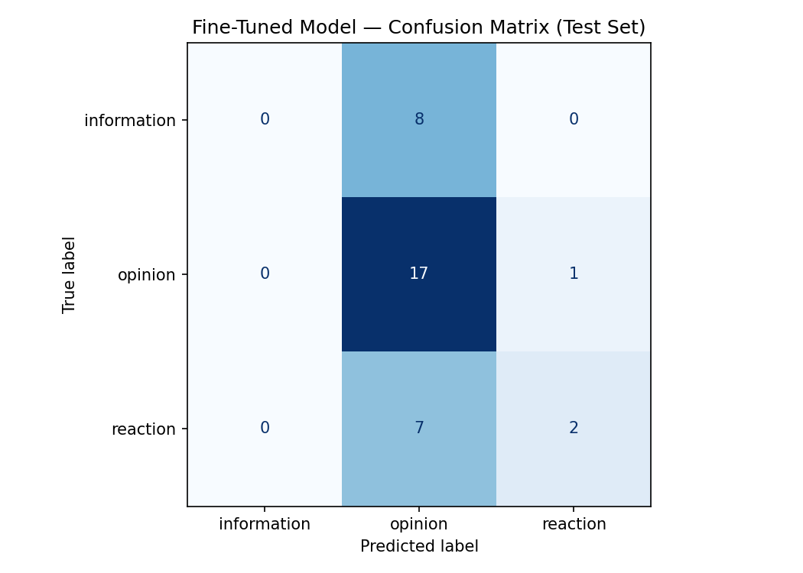

# TakeMeter — Discourse-Quality Classifier for r/youtubedrama

TakeMeter is a fine-tuned text classifier that sorts comments from [r/youtubedrama](https://www.reddit.com/r/youtubedrama/) into three discourse-quality categories: **information**, **opinion**, and **reaction**. The goal is to surface the high-information "receipt" comments in a drama thread from the much larger pile of takes and jokes.

This repo contains the data pipeline, the labeled dataset, the fine-tuning notebook, and an honest evaluation comparing a fine-tuned DistilBERT against a zero-shot Groq baseline. See [planning.md](planning.md) for the design notes behind every decision below.

> **Headline result:** on this task, with only 161 training examples, the fine-tuned DistilBERT **lost** to the zero-shot baseline (macro-F1 0.34 vs 0.71). The fine-tuned model collapsed to predicting the majority class. The analysis below is about *why* — which is the interesting part.

---

## Community

r/youtubedrama is a subreddit where people discuss conflicts and controversies between online creators. A single drama thread's comments span a wide quality range: some users dig up timelines, quotes, and links; some deliver confident verdicts with nothing behind them; and a large fraction are jokes, memes, and emotional reactions. That spread is what the community itself polices ("source?" vs. "that's just your opinion" vs. "lol"), which makes it a good fit for a discourse-quality classifier. The unit of classification is a **single comment** (top-level or reply).

## Labels

| label | definition | example |
|---|---|---|
| **information** | Relays a specific, checkable fact about the drama — who is involved, what happened, a quote, a date, a named video/stream, a link, or a concrete sequence of events. | *"So far Coffeezilla is starting an investigation and LegalEagle reached out to offer help."* |
| **opinion** | A judgment, prediction, or piece of reasoning stated **without** verifiable evidence. Covers both lazy verdicts and analysis that cites no sources. | *"Who would've guessed that the grifters who complain about free speech don't believe in it."* |
| **reaction** | A comedic, expressive, or emotional response with no checkable fact and no real argument — memes, riffs, one-liners, jokes, shock. | *"So... the Mormons are acting like a mafia over Lego!?"* |

**Decision order when a comment fits more than one:** `information > opinion > reaction`. A concrete checkable fact makes it `information` even when it's also opinionated or jokey; a take with no checkable fact is `opinion`; a joke/emotional line with no fact and no argument is `reaction` regardless of length.

## Dataset

- **Source:** Reddit's public `.json` endpoints (no API key required) — append `.json` to any thread URL. Comments were pulled from two threads:
  - *"A Summary of the RecklessBen / Bricks and Minifigs corruption scandal"*
  - *"Dailywire and Matt Walsh force takedown of a Mr. Beat / Cynical Historian video"*
- **Pipeline:** [`parse.py`](parse.py) recursively walks each thread's comment tree, drops bot/automod/deleted comments and anything outside 5–400 words, dedupes, and writes `data/raw_comments.csv` (232 candidate comments).
- **Labeling process:** [`prelabel.py`](prelabel.py) used Groq `llama-3.3-70b-versatile` to pre-label each comment with the definitions above. Every pre-label was then read and corrected by hand. **I overrode 43 of 230 pre-labels (18.7%)**, most of them `opinion → reaction` (sarcasm the model read as a stance). The final labeled file is [`data/labeled.csv`](data/labeled.csv).
- **Final distribution (230 labeled examples):**

  | label | count | share |
  |---|---|---|
  | opinion | 119 | 51.7% |
  | reaction | 58 | 25.2% |
  | information | 53 | 23.0% |

  Largest class 51.7% (≤70% ✅), smallest 23.0% (≥20% target ✅).
- **Split:** stratified 70/15/15 → 161 train / 34 val / 35 test (`random_state=42`).

### Three genuinely hard examples

1. *"I think what people are missing is, even if it falls under fair use, challenging a strike opens up a lawsuit and part of that is providing your real address so you can be served…"* — `information` vs `opinion`. It reads like analysis, but it states a **checkable procedural fact** about how copyright strikes work. **Decided `information`**, because the substance is a verifiable claim, not a verdict on a person.
2. *"God this situation is so messy, all they had to do was hand the collection back. But a CEO is gonna CEO 🤷‍♂️"* — `opinion` vs `reaction`. There's a faint opinion ("all they had to do"), but the dominant register is emotional venting + a meme construction ("a CEO is gonna CEO"). **Decided `reaction`.**
3. *"I'm not sure if anyone has mentioned this but where's the arbitration clause and why hasn't it been triggered?"* — `opinion` vs `reaction`. A rhetorical question that implies a critique but asserts no checkable fact and makes no actual argument. **Decided `reaction`** (it's a thought-bubble, not a position). This one is the closest call in the set and a clear annotation-consistency risk.

## Model & Training

- **Base model:** `distilbert-base-uncased` (HuggingFace) with a 3-class sequence-classification head.
- **Approach:** standard supervised fine-tuning with the HuggingFace `Trainer`, evaluated per-epoch on the validation split, loading the best checkpoint at the end.
- **Key hyperparameter decision — `metric_for_best_model="f1_macro"` (instead of accuracy).** Because `information` is the rarest class, accuracy can stay high while that class is ignored. Selecting the best checkpoint by **macro-F1** forces the rare class to count. Other settings: 3 epochs, learning rate 2e-5, batch size 16, weight decay 0.01, `max_length=256`.

## Evaluation Report

Test set: **35 examples** (8 information, 18 opinion, 9 reaction). Both models evaluated on the same test set.

### Overall metrics

| model | accuracy | macro-F1 |
|---|---|---|
| Zero-shot baseline (Groq `llama-3.3-70b-versatile`) | **0.743** | **0.706** |
| Fine-tuned DistilBERT | 0.543 | 0.338 |
| **Δ (fine-tuned − baseline)** | **−0.200** | **−0.369** |

Fine-tuning was a **regression**. A majority-class-only classifier would score 18/35 = 0.514 accuracy, so the fine-tuned model (0.543) is barely above the trivial baseline.

### Per-class metrics

**Fine-tuned DistilBERT**

| label | precision | recall | F1 | support |
|---|---|---|---|---|
| information | 0.00 | 0.00 | 0.00 | 8 |
| opinion | 0.53 | 0.94 | 0.68 | 18 |
| reaction | 0.67 | 0.22 | 0.33 | 9 |
| **macro avg** | 0.40 | 0.39 | **0.34** | 35 |

**Zero-shot baseline (Groq)**

| label | precision | recall | F1 | support |
|---|---|---|---|---|
| information | 0.64 | 0.88 | 0.74 | 8 |
| opinion | 0.79 | 0.83 | 0.81 | 18 |
| reaction | 0.80 | 0.44 | 0.57 | 9 |
| **macro avg** | 0.74 | 0.72 | **0.71** | 35 |

### Confusion matrix — fine-tuned model

| true ＼ predicted | information | opinion | reaction |
|---|---|---|---|
| **information** | 0 | 8 | 0 |
| **opinion** | 0 | 17 | 1 |
| **reaction** | 0 | 7 | 2 |

The model predicted `opinion` for **32 of 35** comments and predicted `information` **zero** times. This is the entire story of the failure in one table.

### Three failures analyzed

1. *"The unredacted body cam footage was leaked on a public Dropbox for about 40mins — someone grabbed it before it got taken down and posted it on YouTube. The channel is called BAM Sucks."* → **true `information`, predicted `opinion` (conf 0.34).** This is unambiguous `information` to a human (a named channel, a concrete event). The model not only missed it, it did so with confidence barely above the 0.33 random floor — it had no real signal and fell back to the majority class.
2. *"We await the special edition 'Mormon Cops Swat a Youtuber' playset."* → **true `reaction`, predicted `opinion` (conf 0.37).** A clear joke/meme. The model can't distinguish comedic register from a stance and collapses it to `opinion`.
3. *"Oh I hope Viral Virtue/Jordan & Mckay do a video. I gotta check out Alyssa's."* → **true `reaction`, predicted `opinion` (conf 0.34).** This one is genuinely borderline: I labeled it `reaction` because it's an excited, fan-ish expression of hope with no checkable fact and no real argument — but you could read the wish ("I hope X covers this") as a mild `opinion` about who *should* cover the drama. The label depends on how you perceive the intent. Unlike #1 and #2, the model being "wrong" here partly reflects a real ambiguity in the boundary, not just its collapse to `opinion` — though the 0.34 confidence (≈ the random floor) shows it wasn't actually weighing that ambiguity, just guessing the majority class.

**The directional pattern:** **15 of 16 errors are `X → opinion`** (8 information→opinion, 7 reaction→opinion). The lone exception is one `opinion → reaction`. Every error confidence sits between **0.34 and 0.38** — the softmax is nearly uniform across three classes (uniform = 0.33), so the model is effectively guessing and `argmax` lands on whichever class has the highest base rate. That class is `opinion` (51.7% of training data).

**Is this a labeling problem or a data/training problem?** Mostly a data/training problem. Failures #1 (clear `information`) and #2 (a clear `reaction` joke) are cases any annotator would get right, so the model missing them isn't about label ambiguity. Failure #3 is a genuinely borderline `reaction`/`opinion` case — but even there the near-random 0.34 confidence shows the model wasn't actually torn between the two, it was guessing the majority class. The model simply never learned discriminative features: validation macro-F1 peaked at 0.37 after 3 epochs on 161 examples. The boundary it "learned" is just the class prior. The fix is more data, more epochs, and/or class weighting — not a label redefinition.

### AI-assisted failure-pattern surfacing

I pasted the 16 misclassified examples into Claude and asked it to cluster them. It proposed three patterns; I verified each against the data:
- **"Everything collapses to `opinion`" — VERIFIED.** Confirmed directly in the confusion matrix (32/35 predicted opinion; 15/16 errors → opinion).
- **"Confidences are near-random" — VERIFIED.** All error confidences are 0.34–0.38, ≈ the 0.33 uniform floor.
- **"Sarcasm/short posts specifically cause errors" — DISCARDED.** Tempting, but the errors span long factual comments (#1, #6) and short jokes (#10) and mid-length claims (#8). The common factor isn't sarcasm or length; it's that the model has no signal at all, so the surface features don't matter. I dropped this pattern because it implied a fixable feature-level issue when the real cause is global underfitting.

### Sample classifications (fine-tuned model)

Run through the fine-tuned model with confidence scores (from the test set):

| comment (truncated) | predicted | conf | true | correct? |
|---|---|---|---|---|
| "The unredacted body cam footage was leaked on a public Dropbox…" | opinion | 0.34 | information | ❌ |
| "We await the special edition 'Mormon Cops Swat a Youtuber' playset." | opinion | 0.37 | reaction | ❌ |
| "Obviously. What made you think that was a gotcha?" | reaction | 0.35 | opinion | ❌ |
| "I mean yeah there is a skew for getting content out of it (Why else walk to the store…)" | opinion | 0.38 | opinion | ✅ |

For the correctly-predicted `opinion` example ("I mean yeah there is a skew for getting content out of it…"): the prediction is *reasonable* in that this genuinely is an opinion — it's a speculative reading of someone's motives with no checkable fact. But note the confidence is **0.38**, barely above the 0.33 random floor and indistinguishable from the confidences on the model's *wrong* answers. The model is right here for the wrong reason: it predicts `opinion` for almost everything, and most comments happen to be `opinion`. It captured the class prior, not the stance.

### Reflection — what the model learned vs. what I intended

I intended the model to learn the **information → opinion → reaction** boundary: to tell a checkable fact from a take from a joke. What it actually learned was the **class prior** — "when unsure, say `opinion`," because `opinion` is the most common label. The decision boundary it captured is essentially a constant function with a little noise.

- **What it overfit to:** nothing semantic — it underfit. With 161 examples it never moved past the base-rate prior, so the "model" is a slightly noisy majority-class predictor.
- **What it missed:** the entire `information` class (0% recall) and most of `reaction` (22% recall) — exactly the two classes the tool exists to surface. The one thing it "captured" (high `opinion` recall) is an artifact of imbalance, not understanding.

## Spec Reflection

- **How the spec helped:** committing to **macro-F1 + per-class metrics** in planning.md (rather than accuracy alone) is the only reason this result is legible. On accuracy the model looks "54% — not great but okay"; macro-F1 and the per-class table expose that it scored a literal **0.00** on `information`. The metric choice turned a vague "meh" into a precise, diagnosable failure.
- **Where I diverged:** planning.md set a success target of "macro-F1 ≥ 0.65, `information` recall ≥ 0.55." The fine-tuned model missed both badly (0.34 / 0.00). I did not move the goalposts or retrain to chase the number — the regression is reported as-is, because the assignment values a diagnosable failure over a massaged success.

## AI Usage

1. **Annotation pre-labeling (Groq `llama-3.3-70b-versatile`).** I directed it to label all 232 comments with my definitions; it produced a `prelabel` column. I reviewed every one and **overrode 18.7% (43/230)**, mostly sarcastic `reaction` comments it had called `opinion`. Disclosed and tracked via the `prelabel`/`label` columns in `data/labeled.csv`.
2. **Failure-pattern clustering (Claude).** I pasted the 16 misclassifications and asked for common themes. It surfaced the collapse-to-`opinion` and near-uniform-confidence patterns (both verified) and a sarcasm/length pattern (which I discarded after re-reading).
3. **Tooling/scaffolding (Claude).** Helped write `parse.py`, `prelabel.py`, and fill the notebook TODOs (label map, Groq prompt, macro-F1 metric, distribution checks). I reviewed and ran all of it; the labels, edge-case rules, and analysis are my own.

## Repo Structure

| file | purpose |
|---|---|
| [planning.md](planning.md) | design notes: labels, edge cases, metrics, AI plan |
| [parse.py](parse.py) | Reddit `.json` dumps → `data/raw_comments.csv` |
| [prelabel.py](prelabel.py) | Groq pre-labeling → `data/labeled.csv` |
| [data/labeled.csv](data/labeled.csv) | 230 labeled comments (`text`, `label`, `prelabel`, `notes`) |
| `Copy_of_ai201_project3_takemeter_starter_clean.ipynb` | fine-tuning + evaluation notebook |
| [evaluation_results.json](evaluation_results.json) | metrics for both models |
| [confusion_matrix.png](confusion_matrix.png) | fine-tuned confusion matrix |

## Demo
Here is the demo: https://www.youtube.com/watch?v=AETa00IKYos
